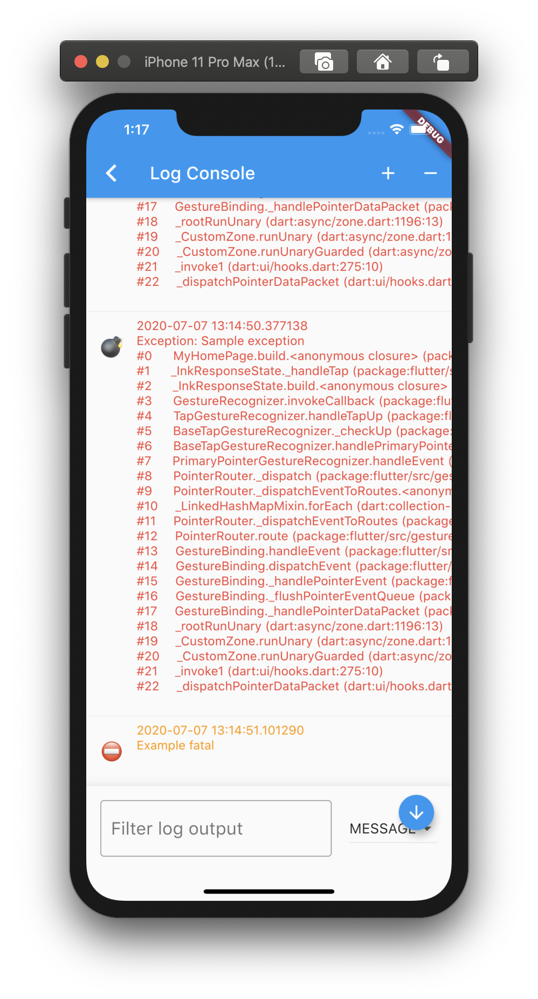

# Lumberdash UI

[](https://pub.dartlang.org/packages/lumberdashui)

A [lumberdash](https://pub.dev/packages/lumberdash) client wich shows the logs in a widget inside your app.

It shows the logs and can filter based on verbosity, and it can search through your logs.
It also has support for light and dark modes.



## Setup

First, you will need to add `lumberdashui` to your `pubspec.yaml`:

```yaml
dependencies:
  flutter:
    sdk: flutter
  lumberdashui: x.y.z # use the latest version found on pub.dev
```

Then, run `flutter packages get` in your terminal.

## Usage

```dart
// import lumberdash and lumberdashui
import 'package:lumberdash/lumberdash.dart';
import 'package:lumberdashui/lumberdashui.dart';

// add LumberdashUiClient() to your lumberdash clients
putLumberdashToWork(withClients: [LumberdashUiClient()]);

// log some logs
logMessage('Example message');
logWarning('Example warning');
logFatal('Example fatal');
logError(Exception('Example exception'));

// open log console
RaisedButton(
  child: Text('open log console'),
  onPressed: () {
    Navigator.push(
      context,
      MaterialPageRoute(
        builder: (context) {
          return LogConsole();
        },
      ),
    );
  },
)
```
See [here](example/lib/main.dart) for a full example.